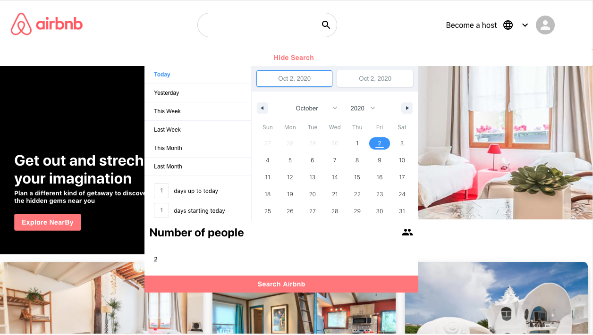
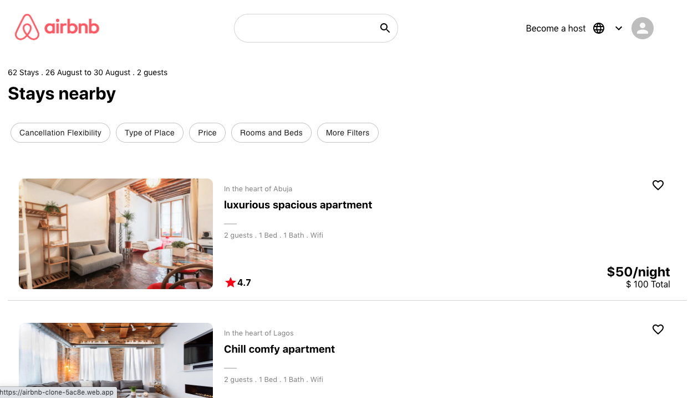

# Airbnb Clone



This is a clone of the airbnb app using React. It shows a home page which has date picker to book stays and displays some of the top listings.

Also has a second page which displays the results of search results.



## Built With

- Html
- Css
- FlexBox
- React
- React-Router
- Material Icons 
- and deployed to firebase

## Getting Started

**This is what needs to be done to  on set up this project locally.**

To get a local copy up and running follow these simple example steps.

### Setup
`Clone the project and cd into the directory`

Install dependencies
```zsh
npm install  
```
run 
```zsh 
npm start or yarn start
```

### Usage
open `localhost:3000 ` with a browser.


## Authors

👤 **Author**

- Github: [@SunnyAsar](https://github.com/SunnyAsar)
- Linkedin: [Sunny Asar](https://www.linkedin.com/in/sunnyasar/)

## 🤝 Contributing

Contributions, issues and feature requests are welcome!

Feel free to check the [issues page](https://github.com/SunnyAsar/airbnb-clone/issues).

## Show your support

Give a ⭐️ if you like this project!

## 📝 License

This project is [MIT](lic.url) licensed.
